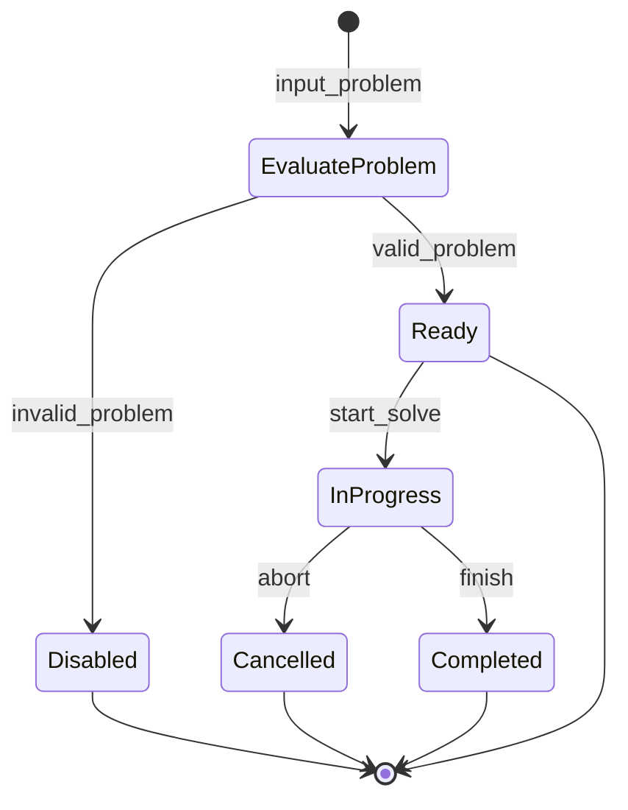
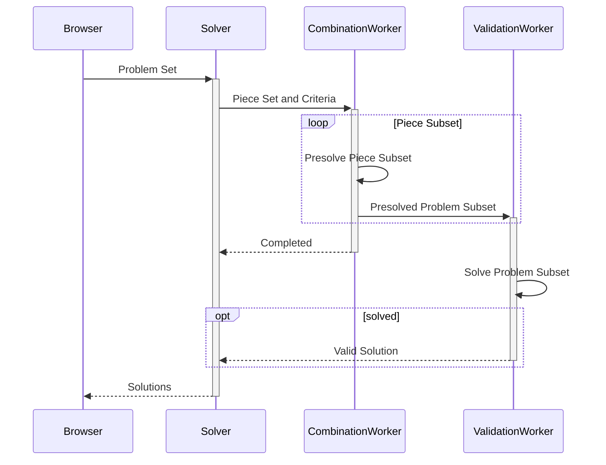

This post is used as a style reference on the design of various markdown elements, as well as demonstration of the various plugins included. 
Below are samples of basic Markdown syntax that can be used when writing Markdown content in Astro, as well as optional plugins that can enhance the reading experience.

## Basic formatting

Text can be formatted in several ways. 
It is commonly formatted as **bold**, *italic*, or ~strikethrough~ text. 
Multiple of these can be combined ~***at the same text***~. 

Links can be either [internal](#headings) or [external](https://developer.mozilla.org/en-US/docs/Web/HTML/Reference/Elements/a), with external links having a little icon using the [`rehype-external-links`](https://docs.astro.build/en/recipes/external-links/) plugin.

## Headings

The following HTML `<h1>` - `<h6>` elements represent six levels of section headings.
The highest section level is `<h1>` while the lowest is `<h6>`.

# H1

## H2

### H3

#### H4

##### H5

###### H6

Although headings 5 and 6 will rarely be used, these were still designed for cases of these being necessary.

## Images

Images are added using the standard markdown syntax.

```md

```


Captions are not a native feature of markdown. 
With the [`rehype-figure-title`](https://github.com/futuraprime/rehype-figure-title) plugin, captions can be added to an image by adding text with quotation marks directly after the image location.

```md

```

The plugin wraps the caption nicely in a `<figcaption>` element, making it easy to style the caption with CSS.


## Blockquotes

The blockquote element represents content that is quoted from another source, optionally with a citation. 
Citations must be within a `footer` or `cite` element, and optionally with in-line changes such as annotations and abbreviations.

> Don't communicate by sharing memory, share memory by communicating.<br />
> &mdash; <cite>Rob Pike</cite>[^1]

[^1]: The above quote is excerpted from Rob Pike's [talk](https://www.youtube.com/watch?v=PAAkCSZUG1c) during Gopherfest, November 18, 2015.

Clicking on the footnote `[1]` will navigate to the footnote section of the page, which also has an anchor link navigating back to this section. 

## Tables

Tables are great for presenting information in tabular format. 
Although it could break the boundaries of the entire page, once there is too many columns in a table.

| Italics   | Bold     | Code   | Hello | 
| --------- | -------- | ------ | ---   |
| _italics_ | **bold** | `code` | hello |
| _italics_ | **bold** | `code` | hello |
| _italics_ | **bold** | `code` | hello |

Similar to HTML's tables, styling a table's responsive design using only CSS is difficult. 
It is set as a low priority for now, with the only workaround of avoiding lengthy content in the table.

## Code and Code Blocks

By surrounding text with a backtick (\`), it is formatted into `code`. 
This is useful for code-related topics to distinguish between keywords of a programming language and plain words.

For code blocks, it must start with 3 backticks in new line and the language of the code (e.g. ```` ```html ````), followed by the code snippet, finally closing the code block with 3 backticks on new line.

```html
<!doctype html>
<html lang="en">
  <head>
    <meta charset="utf-8" />
    <title>Example HTML5 Document</title>
  </head>
  <body>
    <p>Test</p>
  </body>
</html>
```

Syntax highlighting is natively supported in Astro, which also allows a [stylesheet of choice](https://docs.astro.build/en/guides/syntax-highlighting/#add-a-prism-stylesheet) from Prism. 
Since it uses CSS to highlight text in a code block, the colors were modified to align the site's personalized theme.

Below is a sample [Docker command](https://hub.docker.com/_/nginx#exposing-external-port) to showcase more of the color theme:

```bash
$ docker run --name some-nginx -d -p 8080:80 some-content-nginx
```

## List Types

Lists have huge spaces in between each item. This is ideal for readability of longer texts. 
Each item in an ordered list starts with an incrementing number followed by a period and space, i.e. `1. `, `2. `, then the text. 
Nested lists have their numbers indented to the first letter of the item.

1. First item
2. Second item
   3. Sub-item
   4. Sub-item
5. Third item

Unordered lists start each item with `- ` instead.

- List item
- Another item
- And another item
- Dairy
  - Milk
  - Cheese

Task lists are also natively supported in Astro's Markdown by prepending the line of text with `- [x]`. 
However, because Markdown checkboxes are disabled in HTML by default, it has poor color contrast (<input type="checkbox" disabled checked/>). 
Adding a bit of CSS styles to the element resolves this issue.

- [ ] Forgotten task
- [x] What's done is done
- Not-a-checkbox
  - item
  - [x] Sub-item checkbox

## Other Elements

These are some of the supported HTML elements.

```markdown
<abbr title="Graphics Interchange Format">GIF</abbr> is a bitmap image format.

H<sub>2</sub>O

X<sup>n</sup> + Y<sup>n</sup> = Z<sup>n</sup>

Press <kbd>CTRL</kbd> + <kbd>ALT</kbd> + <kbd>Delete</kbd> to end the session.

Most <mark>salamanders</mark> are nocturnal, and hunt for insects, worms, and other small creatures.
```

<abbr title="Graphics Interchange Format">GIF</abbr> is a bitmap image format.

H<sub>2</sub>O

X<sup>n</sup> + Y<sup>n</sup> = Z<sup>n</sup>

Press <kbd>CTRL</kbd> + <kbd>ALT</kbd> + <kbd>Delete</kbd> to end the session.

Most <mark>salamanders</mark> are nocturnal, and hunt for insects, worms, and other small creatures.

## Mermaid Diagrams

The heaviest plugin in this Astro Project, [`astro-mermaid`](https://starlight-mermaid-demo.netlify.app/installation/). 
The vast array of supported diagrams make it worth the addition. 
Mermaid diagrams in Obsidian is fun to use, so it was imported to this project as well. 

The following diagram illustrates the solver state machine of my personal implementation of a [polyomino solver](https://polyomino-solver.pages.dev/).



Below is a sequence diagram from the same project, which also demonstrates the plugin's capabilities.



## Latex

The next section showcases mathematical equations transformed into Latex syntax, a plugin also installed after coming across a [blog post on "Adding support for LaTeX in Astro.js"](https://emasuriano.com/til/2024-06-24-adding-support-for-latex-in-astrojs/).

The **k-means** algorithm divides a set of samples $\{x_1, x_2, \dots, x_n\}$ into $k$ disjoint clusters $C = \{\mu_1, \mu_2, \dots, \mu_k\}$, with each cluster's centroid $\mu_{j}$ placed closest to a subset of data points.
It is the minimization of squared error function[^2]:

$$
\sum_{i=1}^{n}\min_{\mu_j \in C}(||x_i - \mu_j||^2)
$$

where,

- $||x_i - \mu_j||$ is the Euclidean distance between $x_i$ and $\mu_j$.

[^2]: *2.3. Clustering.* (n.d.). Scikit-learn. https://scikit-learn.org/stable/modules/clustering.html#k-means

Close enough, welcome back Obsidian.
